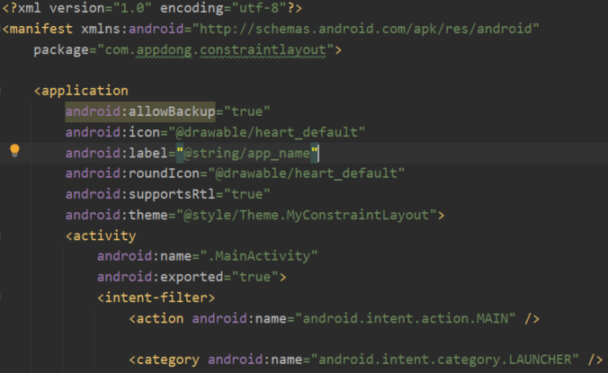

## 앱 기본 정보
-----

 - app/src/main/res/AndroidManifest.xml에서 알 수 있음

### 아이콘
 - android:icon, android:roundIcon에서 변경 가능

### 앱 이름
 - android:label에서 가리키는 위치로 가서 변경 가능
   위 사진에서는 app/src/main/res/values/strings.xml에서 string 태그 안 값으로 변경 가능
   
### AppCompatActivity
 - android의 하위 버전을 지원하는 activity의 일종
 - android 하위버전을 안전하게 지원하고 싶다면 꼭 사용하자