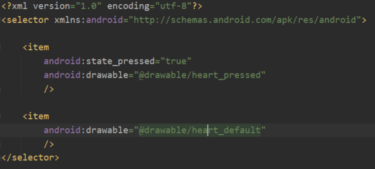
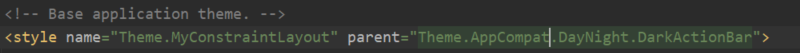
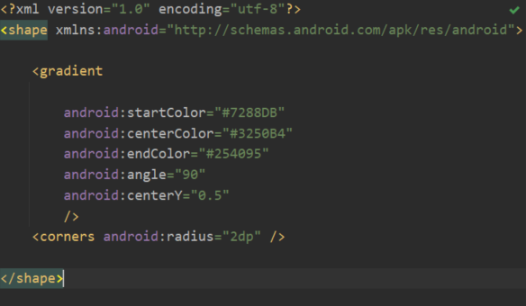
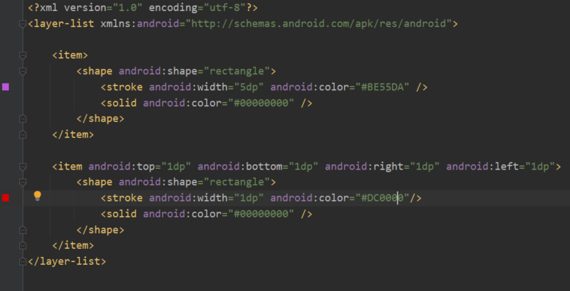
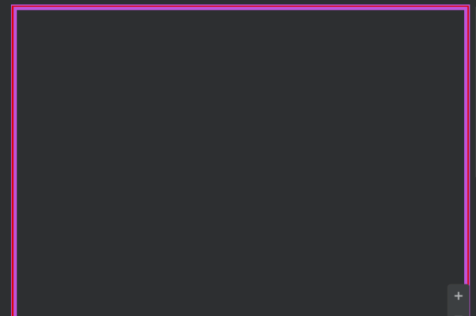

## xml 파일로 Drawable 만들기와 State Drawable
-----------
 

 1. app > src > main > res > drawable 디렉토리에 xml파일 생성
 2. 같은 디렉토리에 사용할 아이콘을 png파일로 넣기
 3. 1의 파일에 android:drawable="@drawable/\[그림파일 이름]" 형식으로 item 작성
 4. (state drawable)누를 때 이미지가 바뀌도록 하려면 android:state_pressed="true" 추가하고 3의 코드 작성
 5. activity_main.xml에 버튼 추가. text 지우고 background에 위 xml파일 넣기

### 주의할 점
------------
 

 - app/src/main/res/values/themes/themes.xml에서 MaterialComponents를 상속받고 있는 경우, 배경이 바뀌지 않음!
 해결 방법:
   - activity_main.xml의 Button을 android.widget.Button,
     또는 androidx.appcompat.widget.AppCompatButton으로 바꾼다
   - themes.xml에서 parent를 'Theme.AppCompat.Light'로 바꾼다(스타일을 아예 바꾸는 방법)

## Shape Drawable로 gradient(그라데이션) 설정
-------------
 
 
 1. selecter 부분을 shape로 바꾸기
 2. gradient 추가하고, 시작 중간 끝색 지정
 3. angle로 각도 지정, centerY로 중간색의 위치 지정
 4. corners 지정해 모서리 둘글게

## Layer List로 겹치는 프레임 만들기
--------

 1. selecter 부분을 layer-list로 바꾸기
 2. item을 추가하고, 모양을 지정해 stroke(테두리)와 solid(채우기) 값 넣기