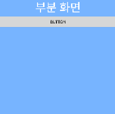
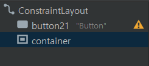

## 인플레이터

### 인플레이션이란?

 - xml 파일에 정의된 내용이 메모리에 올라간 후, 객체화되는 것
 - setContentView() 를 통해 이루어지는데,
   이 때문에 Activity를 구성할 때 onCreate 맨위에 
   setContentView(R.layout.activity_main)가 들어가는 것
 - 인플레이션을 통해 레이아웃 안에 또다른 xml 레이아웃 추가 가능

### 인플레이션 방법
1. 레이아웃 안에 넣을 서브 xml 파일 제작
 
   
2. 서브파일을 넣을 메인 xml 파일과 컨테이너 제작(여기서는 frameLayout을 컨테이너로 설정)
 

3. 코틀린 파일 작성
```kotlin 
    import android.content.Context
    import android.view.LayoutInflater
    ...
```
```kotlin 
   val container = findViewById<FrameLayout>(R.id.container)
   val button = findViewById<Button>(R.id.button21)
   val inflater = getSystemService(Context.LAYOUT_INFLATER_SERVICE) as LayoutInflater
   
   button.setOnClickListener { v ->
      inflater.inflate(R.layout.sub1, container, true)
   }
```