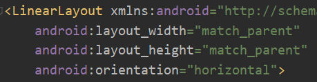
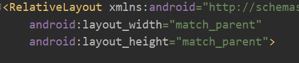
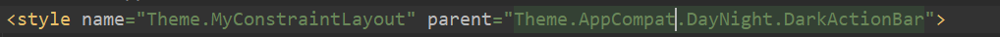
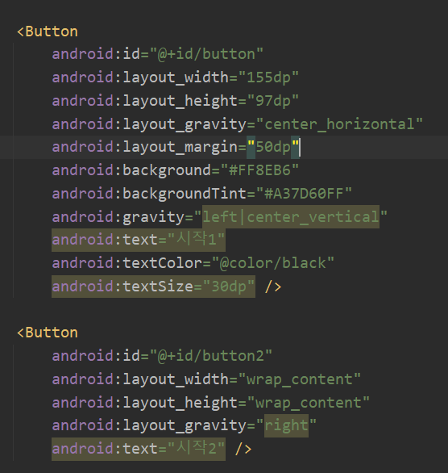
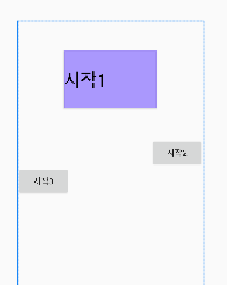
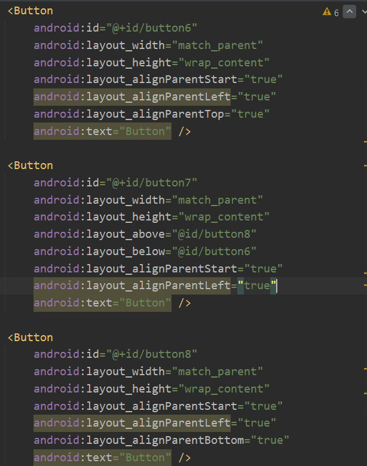
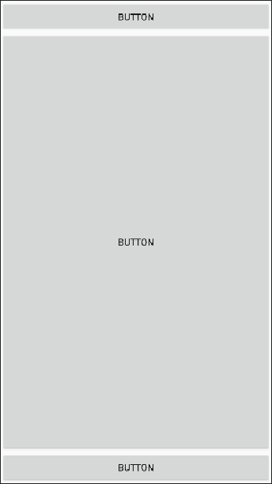

## 레이아웃의 종류
-------------
 - 제약 레이아웃(ConstraintLayout)
   : 말그대로 제약성이 강해 정렬하기엔 편하나, 직접 조절할 수 있는 부분이 많지 않음
   
 - 리니어 레이아웃(LinearLayout)
   
   
   : 가로나 세로 기준 차례대로 항목을 나열하는 레이아웃
   : 방향을 가짐 (orientation: horizontal, vertical)
   
 - 상대 레이아웃(RelativeLayout)
   
   
   : 요소들끼리의 상대적 위치를 기준으로 항목을 나열하는 레이아웃
   : 방향 없음
   
 - 프레임 레이아웃
   : 한 번에 하나의 레이아웃만 보여주고, 다른 뷰는 그 아래에 중첩되어 쌓임

 - 테이블 레이아웃
   : 표처럼 생겼고, 행마다 항목을 보여줌
   : TableLayout 안에 각 행을 TableRow로 추가하고, 그 안에 항목을 넣음
   : 열 맞추려면 stretchColumns 사용
### 버튼 색깔 바꾸기
-----------
   
 - app > main > res > values > themes.xml 들어가서, 
   style 태그의 parent 속성을 MaterialComponent에서 AppCompat으로 바꾼 뒤,
   Button의 background 설정을 바꾸면 됨
   
### LinearLayout - 버튼 바깥 빈공간, 비율 조정
-------------

 - 기본: layout_width, layout_height
 - 바깥 빈공간: layout_margin
 - 여러 버튼 사이 공간 비율: layout_weight(예: 버튼 2개 weight를 1씩 하면 1:1비율로 공간 차지)

### RelativeLayout - 버튼끼리 위치 조정
-----------
 
 - 왼쪽정렬: layout_alignParentStart, layout_alignParentLeft
 - 맨 위에 맞추기: layout_alignParentTop
 - 맨 밑에 맞추기: layout_alignParentBottom
 - 다른 버튼 바로 밑에 붙이기: layout_below
 - 바로 위에 붙이기: layout_above

### 위젯
----------
 - textView : 텍스트 보여줌
 - toggleButton : 켜고 끄는 버튼
 - checkBox : 체크, 해제 가능
 - RadioGroup : 안에 RadioButton 넣어서 관리 가능
 - plain text : 텍스트 입력 창
   여기서 hint property를 수정할 경우, 누르면 사라지는 회색 글자 생성 가능