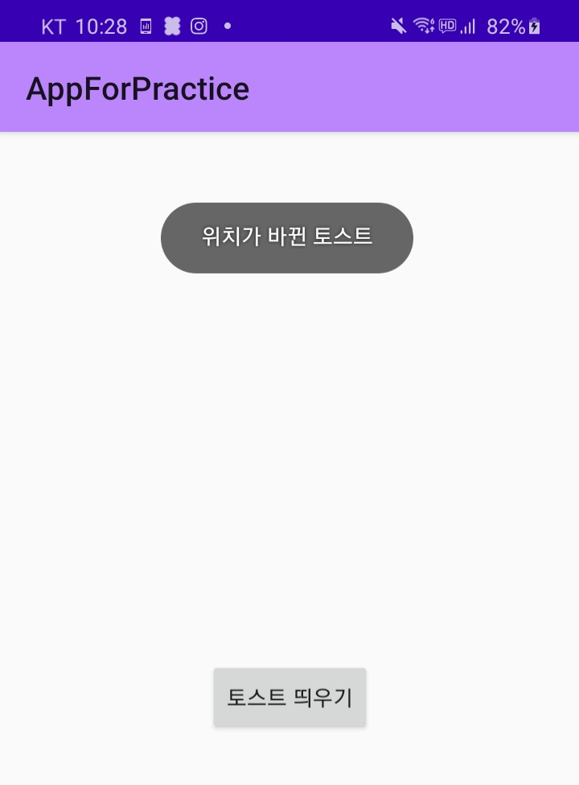
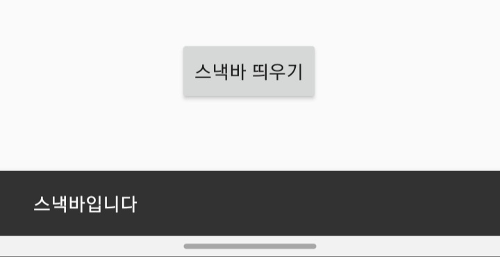

## 토스트, 스낵바 띄우기


 - 토스트 : 짧은 메시지를 전달하는 팝업
   
 - 스낵바 : 짧은 메시지를 띄우고, 옆에 클릭 액션도 추가 가능

### 토스트

```kotlin 
		val button = findViewById<Button>(R.id.toastButton)
		button.setOnClickListener { v ->
			val toast = makeText(this, "위치가 바뀐 토스트", Toast.LENGTH_LONG)
			toast.setGravity(Gravity.TOP or Gravity.START, 200, 200)
			toast.show()
		}
```

### 토스트 커스텀
```kotlin 
		val button2 = findViewById<Button>(R.id.changeButton)
		button2.setOnClickListener { v ->
			val inflater = layoutInflater
			val layout = inflater.inflate(R.layout.toastborder, findViewById(R.id.toast_layout_root))
			val text = layout.findViewById<TextView>(R.id.textToast)
			text.text = "모양을 바꾼 토스트"

			val toast = Toast(applicationContext) //new 필요 x
			toast.setGravity(Gravity.CENTER, 0, -100)
			toast.duration = Toast.LENGTH_LONG
			toast.view = layout

			toast.show()
		}
```
### 스낵바
 - build.gradle(:app)에서
  implementation 'com.google.android.material:material:1.5.0' 추가! 
 - File -> Project Structure 에서 Dependency -> Library Dependency 중
   com.google.android.material:material 추가!
```kotlin 
		val button3 = findViewById<Button>(R.id.button20)
		button3.setOnClickListener { v ->
			var snackbar = Snackbar.make(v, "스낵바입니다", Snackbar.LENGTH_LONG)
			snackbar.show()
		}
```   
### 알림상자
```kotlin 
class AlertDialogActivity : AppCompatActivity() {
	override fun onCreate(savedInstanceState: Bundle?) {
		super.onCreate(savedInstanceState)
		setContentView(R.layout.activity_main)

		val button = findViewById<Button>(R.id.button19)
		button.setOnClickListener { v ->
			showMessage()
		}
	}
```
```kotlin 
fun showMessage() : Unit {
		val builder = AlertDialog.Builder(this)
		val textView = findViewById<TextView>(R.id.textView2) //텍스트 표시를 위해 명목상 필요
		builder.setTitle("안내")
		builder.setMessage("종료하시겠습니까")
		builder.setIcon(android.R.drawable.ic_dialog_alert)

		builder.setPositiveButton("예"){ dialog, which ->
			Snackbar.make(textView, "예 버튼이 눌렸습니다", Snackbar.LENGTH_LONG).show()

		}
		builder.setNegativeButton("아니오"){dialog, which ->
			Snackbar.make(textView, "아니오 버튼이 눌렸습니다", Snackbar.LENGTH_LONG).show()
		}

		val dialog = builder.create()
		dialog.show()
	}
```